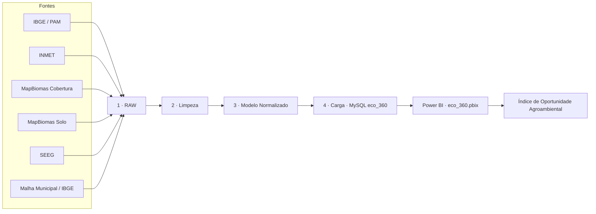
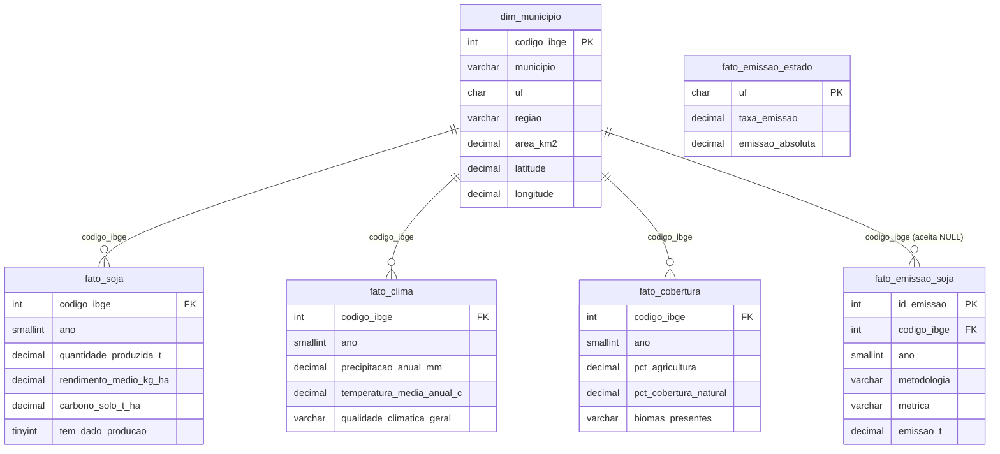

<div align="center">

# 🌱 Eco360
### Inteligência Agroambiental para a Cadeia da Soja

**Raiz Inteligente** · Consultoria em Dados, Descarbonização e Oportunidades de Carbono


*"Transformar dados territoriais da produção de soja em inteligência para descarbonização e geração de oportunidades."*

</div>

---

> 
---

## 📌 Índice

- [O problema](#-o-problema)
- [O que o Eco360 responde](#-o-que-o-eco360-responde)
- [O dashboard](#-o-dashboard)
- [Índice de Oportunidade Agroambiental (IOA)](#-índice-de-oportunidade-agroambiental-ioa)
- [Arquitetura de dados](#️-arquitetura-de-dados)
- [Dicionário de dados](#-dicionário-de-dados)
- [Pipeline de dados (ETL)](#-pipeline-de-dados-etl)
- [Achados e limitações de qualidade de dados](#-achados-e-limitações-de-qualidade-de-dados)
- [Tecnologias](#️-tecnologias)
- [Estrutura do repositório](#-estrutura-do-repositório)
- [Como explorar este projeto](#️-como-explorar-este-projeto)
- [Sobre o projeto](#-sobre-o-projeto)

---

## 🎯 O problema

A produção de soja tem grande peso econômico no **Centro-Oeste e Sul do Brasil**, mas as informações relevantes para avaliar cada território — produtividade, clima, solo, uso da terra, emissões — estão **espalhadas em bases diferentes**, sem chave comum e sem comparabilidade direta.

A Raiz Inteligente precisava de uma estrutura única, no nível do **município**, para responder:

> Onde estão as principais oportunidades de eficiência agrícola, redução de emissões e descarbonização na produção de soja do Centro-Oeste e Sul?

O Eco360 é essa estrutura — e o dashboard é a camada de consumo dela, não o produto em si. O objetivo final é apoiar diagnósticos territoriais e a priorização de municípios para atuação consultiva.

## ❓ O que o Eco360 responde

| Frente | Perguntas |
|---|---|
| 🌾 **Produção** | Quais municípios produzem mais soja? Onde estão as maiores produtividades? Como a produção evoluiu? |
| 🌦️ **Clima** | Quais regiões têm condições mais favoráveis? Como temperatura e precipitação variam entre municípios? |
| 🌳 **Ambiental** | Como o uso do solo está distribuído entre agricultura, vegetação e outros usos? |
| 💨 **Emissões** | Quais municípios emitem mais? Qual a intensidade das emissões da atividade agrícola? |
| 🌍 **Carbono** | Onde existem oportunidades reais de redução de emissões e descarbonização? |

## 📊 O dashboard

Relatório Power BI (`eco_360.pbix`) com 9 páginas. Filtros aplicados de forma consistente entre elas: **UF, região, ano, município e classificação de carbono no solo**.

| # | Página | O que mostra | Screenshot |
|---|---|---|---|
| 1 | **Menu** | Navegação central entre as páginas do relatório | `docs/img/menu.png` |
| 2 | **Visão 360** | Gauge do IOA, mapa geográfico (Azure Maps), KPIs em cards, tabela e filtros globais | `docs/img/visao-360.png` |
| 3 | **Produção** | Produção total, ranking de municípios, variação YoY, comparação Centro-Oeste × Sul | `docs/img/producao.png` |
| 4 | **Clima** | Confiabilidade climática, dispersão entre variáveis, série histórica, tabela dinâmica | `docs/img/clima.png` |
| 5 | **Meio Ambiente** | Cobertura natural, potencial de carbono no solo, treemap de uso do solo | `docs/img/meio-ambiente.png` |
| 6 | **Emissões** | Emissão total (municipal/estadual), intensidade de emissão, coluna 100% empilhada | `docs/img/emissoes.png` |
| 7 | **Território** | Mapa interativo por UF/região, base para diagnóstico territorial | `docs/img/territorio.png` |
| 8 | **Metodologia** | Notas metodológicas e transparência sobre os cálculos | — |
| 9 | **Contato** | Encerramento e contato | — |

**Visuais utilizados:** cards, gauge, tabelas (fixa e dinâmica), mapas geográficos (Azure Maps — custom visual), barras clusterizadas, coluna 100% empilhada, combo linha+coluna, área, dispersão (scatter) e treemap.

> 💡 Para preencher a coluna de screenshots: exporte cada página em **Arquivo → Exportar → PDF** no Power BI, converta as páginas desejadas em `.png` e salve em `docs/img/`.

## 🧭 Índice de Oportunidade Agroambiental (IOA)

O diferencial analítico do projeto. Um indicador em **DAX**, normalizado, que combina 5 pilares:

```
IOA_Score = f( Produtividade, Clima, Emissão⁻¹, Carbono no Solo, Cobertura Natural )
```

| Classificação | Significado |
|---|---|
| 🟢 **Alta oportunidade** | Município prioritário para aprofundamento da análise |
| 🟡 **Média oportunidade** | Apresenta oportunidades, mas requer investigação adicional |
| 🔴 **Baixa oportunidade** | Menor prioridade dentro dos critérios definidos |

> ⚠️ O IOA é um indicador de **priorização** — não é, por si só, uma certificação ou comprovação de elegibilidade para créditos de carbono.

## 🏗️ Arquitetura de dados





`fato_emissao_estado` não possui FK para `dim_municipio`: sua granularidade é estadual (UF), não municipal — fica como tabela de contexto complementar.

## 📖 Dicionário de dados

<details>
<summary><strong>dim_municipio</strong> — 1.661 municípios (UNION de PAM, INMET e MapBiomas)</summary>

| Coluna | Tipo | Descrição |
|---|---|---|
| `codigo_ibge` | `INT` (PK) | Chave única do município (código oficial IBGE) |
| `municipio` | `VARCHAR(100)` | Nome do município |
| `uf` | `CHAR(2)` | Unidade federativa |
| `regiao` | `VARCHAR(20)` | Região (Centro-Oeste / Sul) |
| `area_km2` | `DECIMAL(10,3)` | Área territorial — obtida via MapBiomas (`area_ibge_ha / 100`) |
| `latitude` / `longitude` | `DECIMAL(9,6)` | Centróide oficial IBGE — 1.659 de 1.661 municípios preenchidos |

</details>

<details>
<summary><strong>fato_soja</strong> — produção e produtividade (PAM / MapBiomas Solo)</summary>

| Coluna | Tipo | Descrição |
|---|---|---|
| `codigo_ibge`, `ano` | `INT`, `SMALLINT` | Chave composta (PK/FK) |
| `area_plantada_ha` / `area_colhida_ha` / `area_nao_colhida_ha` | `DECIMAL(12,2)` | Áreas em hectares |
| `aproveitamento_area_pct` | `DECIMAL(6,2)` | % de área colhida sobre plantada |
| `quantidade_produzida_t` | `DECIMAL(14,2)` | Produção total em toneladas |
| `rendimento_medio_kg_ha` | `DECIMAL(10,2)` | Produtividade |
| `valor_producao_mil_reais` | `DECIMAL(14,2)` | Valor da produção |
| `carbono_solo_t_ha` | `DECIMAL(8,2)` | Estoque de carbono no solo |
| `tem_dado_producao` | `TINYINT(1)` | Flag confiável de disponibilidade de dado (ver seção de achados) |

</details>

<details>
<summary><strong>fato_clima</strong> — dados climáticos (INMET)</summary>

| Coluna | Tipo | Descrição |
|---|---|---|
| `codigo_ibge`, `ano` | `INT`, `SMALLINT` | Chave composta (PK/FK) |
| `precipitacao_anual_mm` | `DECIMAL(8,2)` | Precipitação anual |
| `temperatura_media_anual_c` | `DECIMAL(5,2)` | Temperatura média |
| `umidade_media_anual_pct` | `DECIMAL(5,2)` | Umidade relativa média |
| `origem_precipitacao` / `origem_temperatura` / `origem_umidade` | `VARCHAR(30)` | Observado (estação) ou interpolado (IDW) |
| `score_qualidade_climatica` / `qualidade_climatica_geral` | `TINYINT` / `VARCHAR(20)` | Indicadores de confiabilidade do dado |

</details>

<details>
<summary><strong>fato_cobertura</strong> — uso e cobertura da terra (MapBiomas)</summary>

| Coluna | Tipo | Descrição |
|---|---|---|
| `codigo_ibge`, `ano` | `INT`, `SMALLINT` | Chave composta (PK/FK) |
| `area_agricultura_ha` / `area_soja_mapbiomas_ha` / `area_cobertura_natural_ha` / `area_pastagem_ha` | `DECIMAL(12,2)` | Áreas por classe de uso |
| `pct_agricultura` / `pct_soja_mapbiomas` / `pct_cobertura_natural` / `pct_pastagem` | `DECIMAL(6,3)` | Percentuais por classe |
| `biomas_presentes` / `quantidade_biomas` | `VARCHAR(100)` / `TINYINT` | Biomas presentes no município |

</details>

<details>
<summary><strong>fato_emissao_soja</strong> — emissões de GEE por município (SEEG-like, após melt)</summary>

| Coluna | Tipo | Descrição |
|---|---|---|
| `id_emissao` | `INT` (PK, auto increment) | Identificador do registro |
| `codigo_ibge` | `INT` (FK, aceita `NULL`) | Município — nulo quando sem correspondência confirmada |
| `ano` | `SMALLINT` | Ano de referência |
| `metodologia` | `VARCHAR(10)` | AR2 / AR4 / AR5 / AR6 / GASES |
| `metrica` | `VARCHAR(10)` | GTP / GWP / N2O |
| `unidade` | `VARCHAR(10)` | tCO2e / t |
| `tipo_emissao` | `VARCHAR(20)` | Diretas / Indiretas |
| `bioma` | `VARCHAR(30)` | Bioma associado |
| `emissao_t` | `DECIMAL(16,2)` | Volume de emissão |

</details>

<details>
<summary><strong>fato_emissao_estado</strong> — contexto complementar (granularidade UF)</summary>

| Coluna | Tipo | Descrição |
|---|---|---|
| `uf` | `CHAR(2)` (PK) | Unidade federativa |
| `estado`, `regiao`, `cultura` | `VARCHAR` | Metadados |
| `taxa_emissao`, `taxa_ic_inferior`, `taxa_ic_superior` | `DECIMAL(8,2)` | Taxa de emissão e intervalo de confiança |
| `emissao_absoluta`, `emissao_ic_inferior`, `emissao_ic_superior` | `DECIMAL(16,2)` | Emissão absoluta e intervalo de confiança |
| `area_conversao` | `DECIMAL(14,2)` | Área de conversão associada |

</details>

## ⚙️ Pipeline de dados (ETL)

4 camadas — pensadas para que qualquer inconsistência no dashboard seja rastreável até a etapa exata em que foi introduzida:

**1 · RAW → 2 · Limpeza → 3 · Modelo Normalizado → 4 · Carga (MySQL)**

| Tratamento | Descrição |
|---|---|
| Padronização de colunas | Nomes convertidos para minúsculo, sem espaço/acento (`Estado` → `estado`) |
| Decimal BR → internacional | `1.046.479,65` → `1046479.65` (a base estadual usava separador brasileiro) |
| Largo → longo (melt/UNPIVOT) | A base de emissões trazia os anos (2019–2024) como colunas; convertida para formato *tidy* |
| Separação de colunas compostas | `"CO2e (t) GTP-AR2"` → `metrica` (GTP/GWP/N2O) + `unidade` (tCO2e/t) |
| Enriquecimento geográfico | Coordenadas via centróides oficiais do IBGE, não via estações INMET (cobertura de apenas 12,6%) |

Scripts disponíveis: `eco360_mysql.sql` (DDL completo + `LOAD DATA LOCAL INFILE`) e `etl_eco360.py` (carga alternativa via `pandas.to_sql`).

## 🔎 Achados e limitações de qualidade de dados

| Achado | Detalhe | Implicação |
|---|---|---|
| **Nulos no clima são metodológicos** | Cada linha usa dado observado de estação INMET (684 linhas) *ou* interpolado por IDW (9.282 linhas), nunca os dois | Não preencher com 0 |
| **5 municípios sem produção na PAM** | Porto Rico (PR/24), Canoas (RS/24), Cidreira (RS/24), Imbé (RS/24), Parobé (RS/20) — mesmo com `status_dado = "disponivel"` | Usar `tem_dado_producao`, não `status_dado` |
| **Emissão por tonelada quase fixa** | `emissao_t / quantidade_produzida_t` ≈ 0,095 tCO2e/t em 99,6% dos 8.669 registros (fator tipo IPCC) | Não usar como diferenciador de manejo por município |
| **Colunas descartadas por serem constantes** | `cultura` (sempre "soja"); `setor_de_emissao`, `categoria_emissora`, `produto_ou_sistema` (valor único em 34.524 linhas) | Sem poder de diferenciação — removidas do modelo |
| **Base de queimadas (INPE)** | Fonte opcional prevista no escopo original | Avaliada e **não utilizada** na versão atual |

## 🛠️ Tecnologias

| Tecnologia | Aplicação |
|---|---|
| **Python** (pandas) | ETL — extração, limpeza, padronização e carga |
| **SQL / MySQL** | Modelagem relacional (star schema) |
| **GeoPandas** | Geoprocessamento e enriquecimento territorial |
| **Power BI + DAX** | Visualização, dashboard executivo e cálculo do IOA |
| **Azure Maps** | Visual customizado de mapas geográficos |
| **GitHub** | Versionamento |

## 📁 Estrutura do repositório

```
eco360/
├── eco_360.pbix                          # Dashboard Power BI
├── eco360_mysql.sql                      # DDL completo + carga (LOAD DATA LOCAL INFILE)
├── etl_eco360.py                         # Script Python de carga (pandas → MySQL)
├── planejamento_power_bi_eco360.docx     # Colunas por página, gráficos recomendados, DAX do IOA
├── documentacao_pipeline_eco360.pdf      # Decisões técnicas do ETL, do CSV bruto ao modelo relacional
├── Projeto_Eco360.pdf                    # Escopo do case (contexto, objetivos, negócio)
├── docs/
│   └── img/                              # Screenshots das páginas do dashboard
└── README.md
```

## ▶️ Como explorar este projeto

1. **Ver o dashboard sem instalar nada:** confira os screenshots em `docs/img/` (ou exporte-os do `.pbix` — veja a nota na seção [O dashboard](#-o-dashboard)).
2. **Abrir o dashboard interativo:** instale o [Power BI Desktop](https://powerbi.microsoft.com/desktop/) e abra `eco_360.pbix`.
3. **Reproduzir o pipeline do zero:**
   ```bash
   mysql -u root -p < eco360_mysql.sql
   # ou
   python etl_eco360.py
   ```
4. **Entender as decisões técnicas:** leia `documentacao_pipeline_eco360.pdf` — cada tratamento do ETL está documentado com o porquê da escolha.

## 🎓 Sobre o projeto

O Eco360 foi desenvolvido como case da consultoria fictícia **Raiz Inteligente**, para avaliação por banca de empresas e professores. O escopo atual — cultura de soja, regiões Centro-Oeste e Sul — é uma amostra pensada para demonstrar a metodologia; a estrutura foi projetada para expansão a outras culturas e regiões.

## 👥 Equipe

<div align="center">

|    👤 **Membro**    |   👤 **Membro**   |    👤 **Membro**    |
| :-----------------: | :---------------: | :-----------------: |
| **Ana Marly Couto** | **Beatriz Costa** | **Guilherme Gomes** |
|  **Karine Furtado** |  **Rafael Liger** |                     |

</div>

<br>

> 🤝 A construção do **Eco360** foi realizada de forma colaborativa, com integração entre as etapas de **engenharia de dados, análise, modelagem e visualização**, garantindo que o resultado final refletisse o trabalho conjunto da equipe.


<div align="center">

---

**Raiz Inteligente © 2026**

</div>
